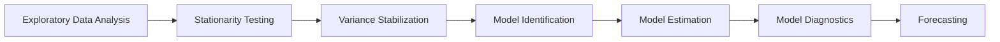
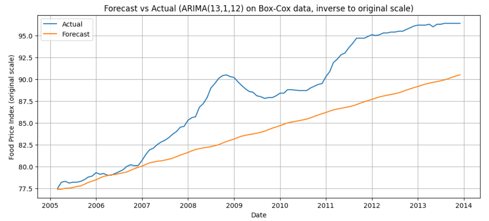

# Food Price Index Time-Series Forecasting
A statistical time-series forecasting project analyzing Food Price Index data using stationarity testing, Box-Cox transformation, ARIMA modeling, and residual diagnostics.

This project demonstrates applied statistical modeling techniques for economic time-series analysis and forecasting.

# Project Objective
To build a statistically sound forecasting model for Food Price Index data by:
- Testing and ensuring stationarity
- Applying variance stabilization techniques
- Identifying appropriate ARIMA parameters
- Evaluating residual diagnostics
- Generating future forecasts
The goal is to produce a reliable time-series forecasting framework based on classical statistical methods.

# Methodology

1. Exploratory Data Analysis (EDA)
   - Time-series visualization
   - Trend and pattern identification
2. Stationarity Testing
   - Augmented Dickey-Fuller (ADF) Test
   - Differencing (if required)
3. Variance Stabilization
   - Box-Cox Transformation
   - Lambda estimation & confidence interval analysis
4. Model Identification
   - ACF (Autocorrelation Function)
   - PACF (Partial Autocorrelation Function)
   - ARIMA parameter selection
5. Model Estimation
   - ARIMA model fitting using statsmodels
6. Model Diagnostics
   - Residual analysis
   - Ljung-Box test for autocorrelation
   - Normality checking
   - Mean Squared Error (MSE) evaluation
7. Forecasting
   - Out-of-sample prediction
   - Forecast visualization
  
# Model Aproach
The forecasting framework follows the classical Box-Jenkins methodology:
1. Identification
2. Estimation
3. Diagnostic Checking
4. Forecasting
This structured approach ensures statistical validity and interpretability of the final model.

# Skills Demonstrated
- Time-Series Analysis
- Statistical Modeling
- ARIMA Modeling
- Stationarity Testing
- Econometric Diagnostics
- Data Visualization
- Forecast Evaluation

# Disclaimer
This project is developed for educational and analytical purposes.
It does not constitute economic or financial advice.

# Author
Yan Andhinaya Ardika
